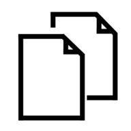
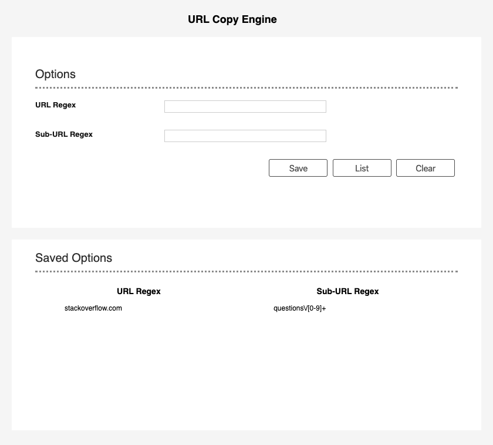
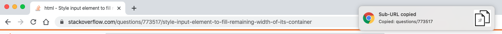

# URLCopyEngine

## Overview
A chrome extension to copy a specific pattern of current URL
I was annoyed by sending certain parts of a url.
For example, I encountered such use cases:

The URL  
`domain/cl/<number>/other_stuff`

While the browser supports such format as `cl/<number>` and it is exchanged via communication channel all the time. 
Having a one click button is way more convenient than select text.

Some website might have a copy button, but having this one you can customize for whatever site.

## Instruction
For an example, if we'd like to match the content of `questions/<number> when visit `stackoverflow.com`.

Go to options page:
1. add which URL pattern to match, as specific as possible, otherwise the pattern of the first matched URL pattern will be selected. In this case: `stackoverflow.com`
2. add the pattern of the URL to match, in this case: `questions\/[0-9]+`
3. click 'Save'

4. Go to `stackoverflow.com` pages, click the extension button, the content you are interested is copied to your clipboard with a notification. Voila, now you can paste it anywhere.

## Disclaimer
Not intended to publish for now, use at your own risk.
