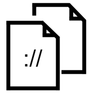

# URLCopyEngine

## Overview
A chrome extension to copy a specific pattern of URL of current tab.

## Instruction
For an example, if we'd like to match the content of `questions/<number>` when visit `stackoverflow.com`.

Go to options page:
1. add which URL pattern to match, as specific as possible, otherwise the pattern of the first matched URL pattern will be selected. In this case: `stackoverflow.com`
2. add the pattern of the URL to match, in this case: `questions\/[0-9]+`
3. click 'Save'

4. Go to `stackoverflow.com` pages, click the extension button, the content you are interested is copied to your clipboard with a notification. Voila, now you can paste it anywhere.

### Disclaimer
Not intended to publish for now, use at your own risk.
